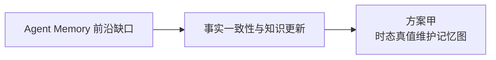

# Agent Memory：时态真值维护记忆图（NeurIPS 导向研究方案）

## Executive Summary

最近一轮 Agent Memory 研究已经从“给 LLM 接一个向量库”转向“把记忆当作智能体的一等公民”：最新综述明确指出，领域正在迅速扩张但概念日益碎片化，传统“长时/短时记忆”二分法已不足以描述当代系统；更有解释力的视角是从 **forms–functions–dynamics** 三个维度来分析记忆系统，并把未来前沿概括为记忆自动化、与强化学习融合、多模态记忆、多智能体记忆和可信性问题。citeturn6search0turn19view0

从评测角度看，现有系统仍远未“解决”长期记忆问题。LongMemEval 用 500 个问题覆盖信息抽取、多会话推理、知识更新、时序推理和 abstention 五类能力，并指出当前长时记忆系统在持续交互中仍存在显著掉点；LoCoMo 则把对话长度扩展到平均约 300 轮、9K token、最多 35 个 session，用来测量长时问答、事件总结和多模态对话生成；MemoryAgentBench 进一步把评测组织成增量式多轮交互，强调准确检索、测试时学习、长程理解与冲突解决等核心能力。citeturn3view6turn10view0turn16view0turn9view6

基于这些最新基线与基准，本方案聚焦一条研究路线：**事实一致性与知识更新**导向的“**时态真值维护记忆图**”，建立在 A-Mem 的自组织记忆网络之上，对应 factual memory 侧重的科学问题——不是泛泛地换一个 retrieval trick，而是把**真值维护**纳入 agent 记忆生命周期。citeturn19view0turn3view3

如果你的目标是“尽快做出可投稿原型”，这条线在**科学问题与投稿说服力之间最为平衡**：方法问题与 LongMemEval / LoCoMo 上的 failure mode 对齐清晰，增量模块（claim 模式、冲突边、一致性子图检索）便于消融与复现。

## 研究基线与选题依据

“为什么是 A-Mem + 真值维护”并不是拍脑袋决定的。A-Mem 代表了**自组织、可演化的显式记忆网络**，是近两年内的开源基线，且有 arXiv 论文与官方代码仓库；在本方案中，它作为起点被推向**冲突处理、时态有效性、可审计更新**。citeturn3view3turn9view3

| Baseline | 论文 / 代码 | 关键方法 | 已报告指标 | 选作 baseline 的原因 |
|---|---|---|---|---|
| **A-Mem** | 论文 citeturn3view3；代码 citeturn9view3 | 受 Zettelkasten 启发，把新记忆写成带 contextual description、keywords、tags 的 note，并自动建立链接、触发旧记忆演化。citeturn3view3turn9view3 | 在 DialSim 上，A-Mem 的 F1 为 3.45，高于 LoCoMo 的 2.55 和 MemGPT 的 1.18；平均每次回答 token 长度约 1,126，远低于 LoCoMo 的 16,910 和 MemGPT 的 16,956。LoCoMo 多类问题上也对多种 backbone 有优势。citeturn4view0turn4view1turn4view2 | 它是当前最具代表性的“自组织记忆图”基线，适合往**冲突处理、时态有效性、可审计更新**方向继续推。 |

下面这张图把本选题与对应的“科学缺口”放在一起看：

为了做到“**快速验证可行性**”，实验栈并不追求大而全，而是围绕公开基准建立：**LongMemEval** 负责知识更新、时序推理与 abstention；**LoCoMo** 负责多 session 长对话与因果/时序证据链；**MemoryAgentBench** 覆盖增量式多轮交互与冲突解决等能力。Proced-Mem 与 ALFWorld 等程序记忆基准与本条线的核心假设无关，此处不展开。citeturn10view0turn16view0turn9view6

## 方案甲 时态真值维护记忆图

A-Mem 的核心优势在于“**记忆会自行组织和演化**”：它不是把历史对话简单切块，而是把新记忆写成结构化 note，再自动建立链接和更新旧记忆，因此在 LoCoMo 与 DialSim 上都优于多种 baseline。问题也恰恰出在这里：A-Mem 的“演化”仍主要是语义层面的组织与重写，**并没有把“某条陈述何时生效、何时失效、与哪条陈述冲突、哪条陈述 supersede 另一条陈述”作为一等对象来建模**。在 LongMemEval 的 knowledge updates、temporal reasoning 与 abstention 任务里，这会直接转化成“旧事实还在被检索”“系统明知冲突却仍然回答”的问题。citeturn3view3turn4view0turn4view2turn3view6

我的建议是把 A-Mem 升级成一个 **Temporal Truth-Maintained Memory Graph**。写入时，不再只生成“note + tags”，而是生成 **claim node + validity interval + provenance + confidence**；近邻检索后，再用一个轻量 NLI/contradiction scorer 判断 `support / contradict / supersede / unrelated` 四类关系，显式写入边。读取时，不再只做 embedding top-k，而是先抽取查询中的时间锚点、实体槽位和更新意图，再在图上做“时态有效 + 语义相关 + 证据一致”的子图检索；如果检索到的最大一致子图仍然存在高冲突，就让系统 abstain 或触发 clarification，而不是硬答。这个变化的科学问题很明确：**长期记忆系统能否从“语义组织”上升到“真值维护”**。

LongMemEval 的数据格式已经给了一个很好的快速验证入口：它不仅有 knowledge-update、temporal-reasoning、abstention 等问题类型，还提供 `answer_session_ids` 作为证据 session；LoCoMo 也提供了 `evidence` dialog ids。换句话说，这两个数据集已经天然支持“写入后未来会不会被用到”“当前回答是否依据了正确证据”的离线监督。citeturn10view0turn9view7

| 项目 | 设计 |
|---|---|
| **核心假设** | 如果把“时间有效性、冲突关系和 supersede 关系”显式写入记忆图，那么系统在知识更新、时序推理和 abstention 上会比普通 agentic note graph 更稳。 |
| **技术贡献** | 一是提出可执行的 claim-level memory schema；二是把 contradiction / supersede 边引入 agent memory 图；三是在回答阶段加入“最大一致子图”检索与 evidence-bound abstention。 |
| **实现方案** | 基于 A-Mem 现有 note 生成器，新增 `writer_temporal.py`、`conflict_linker.py`、`truth_retriever.py` 三个模块。`conflict_linker` 可先用轻量 NLI 模型或 7B LoRA 分类器；图存储前期可直接用 SQLite + NetworkX/igraph，避免过早引入 Neo4j。 |
| **小规模快速验证** | 先做一个 3 天内可跑完的版本：LongMemEval_S 中只取 `knowledge-update / temporal / abstention` 三类共 150–200 个问题；LoCoMo 取 temporal + multi-hop 子集 100–150 个问题；MemoryAgentBench 只跑 CR 子集。对比 A-Mem 原版、普通 hybrid RAG、去掉 truth edges 的退化版。citeturn10view0turn16view0turn9view6 |
| **评价指标** | QA Accuracy / F1 / BLEU-1；abstention precision-recall；retrieval precision@k；contradiction detection F1；单位样本 token 数与延迟。A-Mem 本身就用 F1、BLEU-1 与 token length 报告结果，便于复现对齐。citeturn4view2turn4view0 |
| **消融与对比** | 去掉 validity interval；去掉 contradiction edge；只保留写时过滤、不做读时一致性子图；NLI scorer 换成 embedding-only nearest neighbor。对比基线除 A-Mem 外，建议再加 LongMemEval repo 中的 full-history-session 和 flat RAG。citeturn10view0 |
| **预期结果与失败判定** | 合理目标是：LongMemEval 的 knowledge update / temporal 绝对提升 **3–6 分**，abstention 误答率下降 **20–30%**，且总 token 成本增幅不超过 **15%**。如果绝对提升低于 **2 分** 或者 latency 增幅超过 **20%** 仍无显著收益，我会判为“当前设计不成立”。 |
| **资源估算** | 训练端只需要一个轻量 conflict scorer：1 张 4090 做 5–10 万合成/重标注 pair 的 LoRA，约 **6–10 小时**；全量 benchmark 推理可用 2 张 4090 跑本地 7B/14B reader，约 **12–20 小时**。CPU 16 核、内存 64GB、存储 80GB 足够。 |
| **推荐初始超参** | Reader 用 7B Instruct；embedding top-k=8，truth-consistent rerank top-k=3；LoRA rank 16，lr 2e-4，batch size 64（梯度累积后）；所有实验固定 3 个随机种子。 |
| **NeurIPS 可投稿性** | 新颖性来自“把 truth maintenance 搬进 agent memory 生命周期”；可重复性强，因为增量模块清晰、所用基准公开；审稿人最可能问“这是不是只是一个带时间戳的知识图谱”，应回应：本工作研究的是**记忆写入—演化—检索—回答**闭环，而不是静态 KG 构建。若结果稳定，这条线很像一个标准的 main track 方法论文。 |

我认为这条线的最大优点，是**方法问题和 benchmark failure mode 精准对齐**：不是泛泛地“让记忆更强”，而是明确瞄准 knowledge update、temporal reasoning、abstention 这三类目前最难、也最容易说服审稿人的失败模式。它的主要风险在于：冲突标签本身可能带噪声，导致图越长越“脏”。缓解方式是把 conflict scorer 的输出分成 hard edge 与 soft edge 两层，只有高置信度关系才真正改变 active fact。  

## 综合比较与执行时间线

本方案的核心要素可归纳如下表。这里的“验证难度”和“风险”是研究执行判断，而不是文献事实。

| 方案 | 创新焦点 | Baseline | 快速验证集 | 预计资源 | 验证难度 | 主要风险 | 更适合的投稿叙事 |
|---|---|---|---|---|---|---|---|
| **方案甲** | 事实一致性、时态更新、abstention | A-Mem citeturn3view3turn9view3 | LongMemEval + LoCoMo + MemoryAgentBench | 1–2 张 4090 即可起跑；全量 2 张足够 | 中 | 冲突标签噪声、图膨胀 | 方法论文，强调 memory dynamics 与 trustworthiness |
