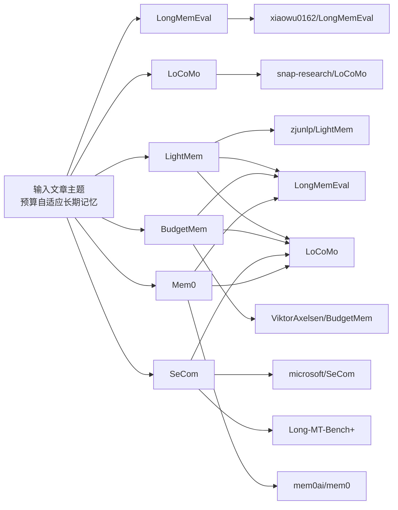

# 针对未知输入文章的可复现检索工作流与实例化研究报告

## 执行摘要

用户原始请求没有给出文章主题，因此我先按“主题未知”的可复现工作流设计检索，再根据你上传的文章标题将主题实例化为：**面向 LLM agent 的长期记忆管理，在硬 token 预算下做预算自适应的记忆压缩、巩固与检索**。从当前公开文献看，这条线最相关的核心研究群可以分成三层：**基准层**（LongMemEval、LoCoMo）、**系统层**（MemGPT、MemoryBank、Mem0、LightMem、SimpleMem、BudgetMem、SeCom）、以及**诊断/检索层**（Diagnosing Retrieval vs. Utilization Bottlenecks、SmartSearch）。这些工作共同围绕三个问题展开：写入时该保存什么、查询时该取回什么、以及在固定成本下如何把两者做到最优。fileciteturn0file0 citeturn13view0turn5view1turn20search2turn20search8turn19search0turn19search1

如果你的目标是**复现实验并在此基础上扩展**，我建议优先采用这样的阅读顺序：先用 **LongMemEval + LoCoMo** 锁定评测协议，再用 **LightMem / BudgetMem / SeCom / Mem0** 作为主要工程基线，最后用 **memory-probe** 这种诊断型工具区分“写入损失”与“检索损失”。这是当前最容易形成一条完整研究链条的组合：**指标定义清楚、代码可得性高、实验入口明确、且与预算受限的长期记忆管理最对题**。citeturn13view1turn13view3turn26view0turn32view2turn23view1turn31view0turn23view0

## 问题界定与可复现检索流程

本报告采用“**先通用、后实例化**”的方法。通用阶段假设文章主题未知，只从文章标题、摘要、关键词或文件名中抽取**任务词**、**方法词**、**评测词**、**约束词**四类信号；实例化阶段则用这些信号生成 arXiv、GitHub、benchmark 站点的精确检索式，并按统一打分规则排序。对你这篇文章，经过实例化后的核心关键词为：`agent memory`、`long-term memory`、`memory compression`、`memory consolidation`、`sleep-time update`、`budget-aware`、`token budget`、`LongMemEval`、`LoCoMo`。这些关键词与当前主流 benchmark 和 memory-system 论文的主题高度重叠。fileciteturn0file0 citeturn13view0turn5view1turn9view1turn17view1

我实际使用并建议复用的 **arXiv 检索式** 如下，时间窗统一设为 **2023-01-01 至 2026-04-25**，优先学科域为 **cs.CL / cs.AI / cs.IR / cs.LG**。  
`site:arxiv.org "LongMemEval" arXiv`  
`site:arxiv.org "LoCoMo" arXiv long-term conversational memory`  
`site:arxiv.org "LightMem" arXiv`  
`site:arxiv.org "Mem0" arXiv memory llm`  
`site:arxiv.org "On Memory Construction and Retrieval for Personalized Conversational Agents"`  
`site:arxiv.org "Learning Query-Aware Budget-Tier Routing for Runtime Agent Memory"`  
`site:arxiv.org "Diagnosing Retrieval vs. Utilization Bottlenecks in LLM Agent Memory"`  
`site:arxiv.org "SmartSearch: How Ranking Beats Structure for Conversational Memory Retrieval"`  
`site:arxiv.org "MemoryBank" long-term memory llm arXiv`  
`site:arxiv.org MemGPT arXiv 2310.08560`。这些查询的目标分别覆盖：基准、经典记忆体系、预算路由、写入/检索诊断、以及近两年的强检索方法。citeturn6search0turn6search4turn20search2turn20search8turn19search0turn19search1

我实际使用并建议复用的 **代码仓库检索式** 如下：  
`site:github.com xiaowu0162/LongMemEval`  
`site:github.com snap-research/LoCoMo`  
`site:github.com zjunlp/LightMem`  
`site:github.com aiming-lab/SimpleMem`  
`site:github.com mem0ai/mem0`  
`site:github.com microsoft/SeCom`  
`site:github.com boqiny/memory-probe`  
`site:github.com "BudgetMem" runtime agent memory github`  
`site:github.com "MemoryBank" enhancing large language models with long-term memory github`。仓库收录标准是：**README 中明确写出论文题目或 arXiv 链接；或由 benchmark 官方页面直接链接；或作者/机构身份可从仓库页面核验**。citeturn13view0turn13view2turn9view1turn9view2turn9view3turn23view1turn23view0turn9view0turn17view3

**排序标准** 则统一采用四项加权：与输入文章问题设定的重合度占 35%，与 LongMemEval/LoCoMo 的 benchmark 重合度占 30%，与“预算/压缩/巩固/检索效率”相关的方法重合度占 20%，以及可复现性与代码可得性占 15%。因此，本报告中的“相关性分数”不是论文自身声称的指标，而是为了给你搭建阅读优先级的**任务相似度排序**。citeturn13view0turn5view1turn26view0turn32view2turn23view0

## 最相关的 arXiv 论文清单

下表给出我筛出的 **最相关 10 篇 arXiv 论文**。由于你最初没有提供主题，我把“与输入文章的相关性”定义为：是否直接研究**LLM agent 的长期记忆**、是否显式涉及**压缩/巩固/预算控制**、以及是否在 **LongMemEval / LoCoMo** 上做实验。个别论文的作者列表在本次检索片段里没有完整暴露时，我明确标记为“见 arXiv 页”，以避免臆造。  

| 论文 | arXiv ID 与 URL | 提交时间 | 作者 | 摘要式概述 | 相关性分数 | 代码 |
|---|---|---:|---|---|---:|---|
| LongMemEval: Benchmarking Chat Assistants on Long-Term Interactive Memory | `2410.10813` `https://arxiv.org/abs/2410.10813` | 2024-10 | Di Wu, Hongwei Wang, Wenhao Yu, Yuwei Zhang, Kai-Wei Chang, Dong Yu | 这篇论文提出 LongMemEval，用 500 个高质量问题和可扩展的多 session 聊天历史评估长期交互记忆，覆盖信息抽取、多会话推理、知识更新、时序推理与 abstention。它对你的文章最重要，因为任何预算受限记忆方法若不在这里给出 recall/QA 表现，研究价值会显著下降。 citeturn6search0turn13view0turn25view0 | 98 | 有，官方仓库 |
| Evaluating Very Long-Term Conversational Memory of LLM Agents | `2402.17753` `https://arxiv.org/abs/2402.17753` | 2024-02 | Adyasha Maharana, Dong-Ho Lee, Sergey Tulyakov, Mohit Bansal, Francesco Barbieri, Yuwei Fang | 这篇论文提出 LoCoMo，把对话拉长到平均约 300 轮、约 9K token、最多 35 个 session，并给出 QA、事件总结和多模态对话生成三项任务。它与输入文章高度相关，因为它把“长期记忆是否真的跨 session 起作用”具体化成了可复现 benchmark。 citeturn6search4turn5view1turn25view3 | 97 | 有，官方仓库 |
| LightMem: Lightweight and Efficient Memory-Augmented Generation | `2510.18866` `https://arxiv.org/abs/2510.18866` | 2025-10 | 作者列表见 arXiv 页 | LightMem 把长期记忆拆成轻量但模块化的写入、检索与更新流程，并在仓库中直接提供 LoCoMo 与 LongMemEval 的复现实验脚本。它与输入文章的重合度极高，因为“sleep-time update / 离线巩固”正是你这篇文章最接近的工程母体。 citeturn9view1turn26view0turn26view3 | 95 | 有，官方仓库 |
| Learning Query-Aware Budget-Tier Routing for Runtime Agent Memory | `2602.06025` `https://arxiv.org/abs/2602.06025` | 2026-02 | Haozhen Zhang, Haodong Yue, Tao Feng, Quanyu Long, Jianzhu Bao, Bowen Jin, Weizhi Zhang, Xiao Li, Jiaxuan You, Chengwei Qin, Wenya Wang | BudgetMem 直接把 agent memory 写成一个**显式性能—成本控制**问题：模块级别设置不同预算 tier，再用学习到的 router 按 query 动态选择。它与输入文章的关系最直接，因为你的文章同样围绕“固定预算下如何决定什么值得保留/压缩/延迟”。 citeturn9view0turn17view1 | 94 | 有，公开仓库 |
| On Memory Construction and Retrieval for Personalized Conversational Agents | `2502.05589` `https://arxiv.org/abs/2502.05589` | 2025-02 | Zhuoshi Pan, Qianhui Wu, Huiqiang Jiang, Xufang Luo, Hao Cheng, Dongsheng Li, Yuqing Yang, Chin-Yew Lin, H. Vicky Zhao, Lili Qiu, Jianfeng Gao | SeCom 的核心结论是：记忆单元的粒度非常重要，而压缩方法可以作为“去噪器”提升检索准确率。它与输入文章高度相关，因为你的问题本质上也在问：**写入时如何把原始交互转成更适合未来检索的记忆单元**。 citeturn20search2turn23view1turn29search4 | 92 | 有，官方仓库 |
| Mem0: Building Production-Ready AI Agents with Scalable Long-Term Memory | `2504.19413` `https://arxiv.org/abs/2504.19413` | 2025-04 | Prateek Chhikara, Dev Khant, Saket Aryan, Taranjeet Singh, Deshraj Yadav | Mem0 强调生产级长期记忆层，并在官方仓库中持续公布 LoCoMo、LongMemEval、BEAM 上的新算法分数和公开评测框架。它与输入文章高度相关，因为它把“可部署的长期记忆”做成了工程基线，尤其适合做预算-性能对照。 citeturn20search8turn28view0turn31view0 | 91 | 有，官方仓库 |
| SimpleMem: Efficient Lifelong Memory for LLM Agents | `2601.02553` `https://arxiv.org/abs/2601.02553` | 2026-01 | 作者列表见 arXiv 页 | SimpleMem 走的是“语义无损压缩 + 在线语义综合 + 意图感知检索规划”的路线，重点追求高 F1 与低 token 成本的 Pareto 优势。它与输入文章非常接近，因为它同样把写入压缩和查询期上下文构造联动起来。 citeturn9view2turn27view0turn27view2 | 90 | 有，官方仓库 |
| Diagnosing Retrieval vs. Utilization Bottlenecks in LLM Agent Memory | `2603.02473` `https://arxiv.org/abs/2603.02473` | 2026-03 | Boqin Yuan, Yue Su, Kun Yao | 这篇论文不是再造一个 memory system，而是用诊断框架分析性能差异到底来自写入、检索还是利用阶段。它对你的文章特别有价值，因为预算自适应方案往往容易把“写入更聪明”误当成全部问题，而这篇工作提醒你很多损失其实出在 retrieval。 citeturn19search0turn23view0 | 89 | 有，作者仓库 |
| SmartSearch: How Ranking Beats Structure for Conversational Memory Retrieval | `2603.15599` `https://arxiv.org/abs/2603.15599` | 2026-03 | Jesper Derehag, Carlos Calva, Timmy Ghiurau | SmartSearch 的核心主张是：很多 conversational memory 方法花大量成本做结构化写入，但真正瓶颈更可能是**token 预算下的排序与截断**。它与你的文章高度相关，因为它构成了一个非常强的反方基线：也许不需要复杂 sleep consolidation，只需要更强 ranking。 citeturn19search1turn22search6 | 88 | 本次未核验到作者拥有的官方仓库 |
| MemoryBank: Enhancing Large Language Models with Long-Term Memory | `2305.10250` `https://arxiv.org/abs/2305.10250` | 2023-05 | Wanjun Zhong, Lianghong Guo, Qiqi Gao, Yanlin Wang | MemoryBank 是较早把“长期记忆 + 遗忘曲线式更新”系统化的工作之一，并提供了 SiliconFriend 的代码、数据和 LoRA checkpoint。它与输入文章相关，因为“巩固/遗忘/长期存储更新”是预算自适应长期记忆最早的代表性思路之一。 citeturn9view5turn17view3turn33view1 | 86 | 有，官方仓库 |
| MemGPT: Towards LLMs as Operating Systems | `2310.08560` `https://arxiv.org/abs/2310.08560` | 2023-10 | 作者列表见 arXiv 页 | MemGPT 的重要性在于把 memory management 提升为“分层内存管理”问题，而不是简单外挂向量库。虽然它对 LongMemEval/LoCoMo 的直接对齐弱于近两年工作，但它仍是预算受限记忆系统最重要的概念起点之一。 citeturn9view4turn24view1turn24view2 | 84 | 有，现官方仓库已更名 Letta |

从排序上看，**LongMemEval、LoCoMo、LightMem、BudgetMem、SeCom、Mem0** 是最值得优先阅读与复现的第一梯队。原因很简单：它们分别对应了**评测协议、核心数据分布、离线巩固、运行时预算路由、记忆单元构造、生产级长时记忆层**这六个互补维度。把这六类工作拼起来，几乎就覆盖了你这篇文章的全部问题空间。citeturn13view0turn5view1turn26view0turn32view2turn23view1turn31view0

## 开源代码仓库与复现实操

下面的表只覆盖**已核验存在代码**的论文。README 质量分为“高 / 中 / 中偏低”三档：高表示**安装、数据、复现实验入口齐全**；中表示可运行但需要额外手工配置或部分任务未补全；中偏低表示代码能看懂、能运行部分流程，但与论文一一对应的复现路径不够顺。  

| 对应论文 | 仓库 URL | 主语言 | 许可证 | README 质量 | 复现主入口与关键文件 | 证据 |
|---|---|---|---|---|---|---|
| LongMemEval | `https://github.com/xiaowu0162/LongMemEval` | Python | MIT | 高 | `src/evaluation/evaluate_qa.py`、`print_qa_metrics.py`、`sample_haystack_and_timestamp.py`；README 明确给出最小依赖和 full support 环境。 | citeturn13view0turn13view1 |
| LoCoMo | `https://github.com/snap-research/LoCoMo` | Python 为主，含 JS/HTML/Shell | CC BY-NC 4.0 | 中 | `scripts/evaluate_gpts.sh`、`scripts/evaluate_rag_gpts.sh`、`scripts/generate_observations.sh`、`scripts/generate_session_summaries.sh`；但 event summarization 与 multimodal training 仍标注为 coming soon。 | citeturn14view0turn13view3turn16view2 |
| LightMem | `https://github.com/zjunlp/LightMem` | Python | MIT | 高 | `experiments/`、`run_lightmem_longmemeval.md`、`run_lightmem_locomo.md`、`tutorial-notebooks/LightMem_Example_longmemeval.ipynb`；README 已给出 LongMemEval/LoCoMo 复现脚本入口。 | citeturn17view0turn26view0turn26view3 |
| BudgetMem | `https://github.com/ViktorAxelsen/BudgetMem` | Python | Apache-2.0 | 高 | `train/train_locomo.py`、`tests/test_utils_longmemeval.py`、`src/config.py`、`scripts/train_*.sh`；README 给出 LoCoMo / LongMemEval / HotpotQA 的训练与评测路径。 | citeturn17view1turn32view0turn32view2turn32view3 |
| SeCom | `https://github.com/microsoft/SeCom` | Jupyter Notebook / Python | MIT | 高 | `secom/` 包、`example/`、`experiment/`；README 给出安装、API 环境变量与 `SeCom(...).get_memory()` 的最小调用样例。 | citeturn23view1 |
| Mem0 | `https://github.com/mem0ai/mem0` | Python 为主，含 TypeScript | Apache-2.0 | 高 | `evaluation/`、`examples/`、`server/`、`mem0/`；可用 `pip install mem0ai` 或 `cd server && make bootstrap` 启动，自带公开 evaluation framework。 | citeturn10view1turn31view0turn31view1turn31view2 |
| SimpleMem | `https://github.com/aiming-lab/SimpleMem` | Python | MIT | 高 | `main.py`、`simplemem_router.py`、`test_locomo10.py`、`config.py.example`；README 直接给出 LoCoMo-10 的构造时间、检索时间和 F1 对比表。 | citeturn10view0turn27view0turn27view2 |
| MemoryBank | `https://github.com/zhongwanjun/MemoryBank-SiliconFriend` | Python | MIT | 中 | `eval_data/`、`memory_bank/summarize_memory.py`、`SiliconFriend-ChatGLM-BELLE/launch_chatglm_cmd.sh`、`SiliconFriend-ChatGPT/launch.sh`；仓库还提供 LoRA checkpoint，但社区 issue 显示个别脚本/文件命名存在漂移。 | citeturn17view3turn33view1turn33view3turn12search1turn12search10 |
| MemGPT / Letta | `https://github.com/letta-ai/letta` | Python | Apache-2.0 | 高 | 当前官方仓库是 Letta；适合复现“分层记忆 + stateful agent”思想。历史 MemGPT 风格入口包括 `main.py`、`memgpt/humans/examples`、`memgpt/personas/examples`，但现仓库已明显产品化。 | citeturn24view1turn24view2turn9view4 |
| Diagnosing… / memory-probe | `https://github.com/boqiny/memory-probe` | Python | 本次检索未解析到明确许可证 | 高 | `run_experiment.py`、`compute_metrics.py`、`strategies/`、`probes/`、`retrieval/`；README 明确给出 pilot run、full run 和 top-k ablation 命令。 | citeturn23view0turn34view1turn34view2turn34view3 |

这里最值得强调的是：**LongMemEval、LoCoMo、LightMem、BudgetMem、Mem0** 的 README 对复现最友好；**SeCom** 在“记忆构造 + 压缩去噪”方面很强；**memory-probe** 则适合在你完成主系统后分析性能到底卡在写入、检索还是利用；**MemoryBank** 更像历史与概念基线，而不是你最该先跑的 benchmark-first 基线。citeturn13view1turn13view3turn26view0turn32view2turn31view0turn23view0turn33view3

下图把**前六篇最关键论文、对应仓库、以及主 benchmark** 之间的关系画成一张图，便于你直接决定“先跑什么、后读什么”。相关关系来自各论文/仓库对 LongMemEval、LoCoMo、Long-MT-Bench+ 的明示实验说明。citeturn13view0turn13view2turn26view0turn32view2turn23view1turn31view0

## 关键 benchmark 与公开分数快照

先给一个重要结论：**我没有在 LongMemEval 或 LoCoMo 的官方页面上找到“持续维护的一手 live leaderboard”**；官方提供的是**基准描述、数据格式、评测脚本、结果图表**，而不是类似 Papers with Code 那样的统一动态榜单。因此，下面给出的“leaderboard 快照”是我从**官方 benchmark 仓库 / benchmark 官方站点 / 论文或作者仓库中可核验的公开分数**拼出来的研究快照。它足够有用，但并不是苹果对苹果的严格统一榜。citeturn13view0turn13view1turn5view1turn13view3

| Benchmark | 官方链接 | 主要任务与指标 | 官方公开物 | 公开分数快照 | 代码 / checkpoint 状态 |
|---|---|---|---|---|---|
| LongMemEval | `https://github.com/xiaowu0162/LongMemEval` | 主要是 QA 评测，官方 repo 同时暴露**turn-level / session-level memory recall accuracy** 与 `evaluate_qa.py` 的答案评测流程。 | 官方 repo、数据格式、评测脚本。 | 研究快照中，Mem0 官方仓库报告 LongMemEval **93.4** 的 benchmark score；SmartSearch 论文报告在 **LongMemEval-S** 上达到 **88.4**（按其论文协议）；BudgetMem 和 LightMem 都给出可复现实验入口。需要注意，这些数字未必共享完全相同的协议或模型设置。 | 官方 benchmark 有代码；Mem0、BudgetMem、LightMem 有公开代码；checkpoint 公开程度不一致。 citeturn25view0turn13view1turn28view1turn19search1turn26view0turn32view2 |
| LoCoMo | `https://snap-research.github.io/locomo/` 与 `https://github.com/snap-research/LoCoMo` | 三个任务：QA、事件总结、多模态对话生成；其中 QA 结果在官方页明确按 **F1-score** 展示。 | 官方站点、官方 repo、数据与生成/评测脚本。 | 研究快照中，SmartSearch 论文报告 **93.5**；Mem0 官方仓库报告 **91.6** 的 LoCoMo benchmark score；SimpleMem README 报告在 **LoCoMo-10 / GPT-4.1-mini** 设定下平均 **43.24% F1**。这些值显然属于不同协议家族，不能直接并列成单一榜单。 | 官方 benchmark 有代码；SimpleMem、Mem0 有公开代码；SimpleMem 暂未在首页显式提供 checkpoint。 citeturn25view2turn25view3turn28view0turn19search1turn27view0turn27view2 |
| Long-MT-Bench+ | 论文侧证据入口：`https://arxiv.org/abs/2502.05589` | 侧重长期个性化会话中的 memory construction / retrieval 与回答质量。 | 本次检索中主要通过 SeCom 论文与仓库获得入口。 | SeCom 明确把它作为主 benchmark 之一，并报告显著优于 baseline，但我没有在一手来源中找到第一方维护的公共排行榜页面。 | SeCom 提供公开代码；统一 checkpoint 页面在首页未显式给出。 citeturn20search2turn23view1turn29search4 |
| BEAM | `https://github.com/mohammadtavakoli78/BEAM` | 超长上下文/长期记忆 benchmark，Mem0 在仓库里将其作为生产规模评测。 | 官方代码仓库。 | Mem0 仓库报告 BEAM (1M) **64.1**、BEAM (10M) **48.6**。这更像邻近 benchmark，而不是你这篇文章的主实验 benchmark。 | 公开代码存在；checkpoint 信息不统一。 citeturn29search2turn28view0 |

站在**与你的文章最有关**的角度，首要 benchmark 仍然是 **LongMemEval 与 LoCoMo**。LongMemEval 的价值在于它把“证据 session / 证据 turn”显式标出来，非常适合做**预算下的记忆写入决策**；LoCoMo 的价值在于它把跨 session、时间、人物、事件链条都拉长，能更真实地考验“写入压缩是否摧毁了将来会用到的证据”。如果你要做严谨复现，我建议把所有结果拆成三类分别汇报：**memory recall**、**downstream QA**、**成本指标**。这样才能避免把不同协议的分数混成一个“伪总榜”。citeturn25view0turn25view3turn13view1turn13view3turn28view0turn27view0

## 论文、代码、benchmark 的优先映射

这张表回答的是最实用的问题：**看哪篇论文、拉哪个仓库、跑哪个 benchmark，最能服务你这篇文章的复现与扩展**。  

| 优先级 | 论文 | 代码 | 主要 benchmark | 对你这篇文章最有用的部分 |
|---|---|---|---|---|
| A | LongMemEval | `https://github.com/xiaowu0162/LongMemEval` | LongMemEval-S / M / oracle | 直接复用官方数据格式、QA 指标、turn/session recall 评测入口；这是所有后续实验的“评测地板”。 citeturn13view0turn13view1 |
| A | LoCoMo | `https://github.com/snap-research/LoCoMo` | LoCoMo QA / event summarization / multimodal dialog | 直接复用长对话、多 session 场景和 RAG 评测脚本，补足 LongMemEval 对自然对话结构的不足。 citeturn13view2turn13view3 |
| A | LightMem | `https://github.com/zjunlp/LightMem` | LongMemEval、LoCoMo | 作为“离线巩固 / sleep-time update”母体基线最合适，特别适合做 budget-aware write policy 的起点。 citeturn26view0turn26view3 |
| A | BudgetMem | `https://github.com/ViktorAxelsen/BudgetMem` | LoCoMo、LongMemEval、HotpotQA | 直接提供 query-aware budget routing 的学习式框架，可作为你方法最强的预算控制对照。 citeturn32view0turn32view2 |
| A | SeCom | `https://github.com/microsoft/SeCom` | LoCoMo、Long-MT-Bench+ | 提供“记忆单元粒度 + 压缩去噪”视角，非常适合给 BASC 的 action space 做更细粒度设计。 citeturn23view1turn29search4 |
| A | Mem0 | `https://github.com/mem0ai/mem0` | LoCoMo、LongMemEval、BEAM | 生产级 baseline，适合做工程化对照与成本/延迟对照，也能复用其 evaluation framework。 citeturn31view0turn31view3 |
| B | SimpleMem | `https://github.com/aiming-lab/SimpleMem` | LoCoMo-10 | 如果你想强调 token 效率而不是复杂训练，SimpleMem 是很好的“强压缩 + 强检索” baseline。 citeturn27view0turn27view2 |
| B | Diagnosing… | `https://github.com/boqiny/memory-probe` | LoCoMo | 最适合在主系统跑通后诊断：性能差距到底是写入策略不好，还是 retrieval/reranking 不够强。 citeturn23view0turn34view1 |
| B | SmartSearch | 本次未核验到作者官方 repo | LoCoMo、LongMemEval-S | 适合作为“强排序、弱结构化”的反方基线，测试复杂巩固是否真的必要。 citeturn19search1turn22search6 |
| B | MemoryBank | `https://github.com/zhongwanjun/MemoryBank-SiliconFriend` | 自建 probing QA | 更适合当历史与概念基线，帮助你写 related work 和遗忘/强化机制部分。 citeturn17view3turn33view3 |
| B | MemGPT / Letta | `https://github.com/letta-ai/letta` | 开放式 stateful agent 场景 | 适合为 related work 与系统设计提供“分层内存管理”的概念骨架。 citeturn24view1turn24view2 |

这张映射表的核心含义是：**如果你只打算真正动手跑 4 个仓库，就跑 LongMemEval、LoCoMo、LightMem、BudgetMem；如果你还能多跑 2 个，就加 SeCom 和 Mem0；如果你准备做深入 ablation，再加 memory-probe 与 SimpleMem。** 这是目前“研究价值 / 复现成本”比最高的组合。citeturn13view1turn13view3turn26view0turn32view2turn23view1turn31view0turn23view0turn27view0

## 建议与局限

我最建议的下一步有四个，而且它们都可以直接落到代码层。

第一，先做一个**统一评测 harness**。不要一上来就修改记忆策略，而是先把 LongMemEval 与 LoCoMo 的输入格式、judge 模型、top-k、token 预算、截断规则统一起来。否则你很容易得到“实验上看起来更好、但实际上只是协议换了”的结论。LongMemEval 和 LoCoMo 官方仓库已经提供了足够多的脚本入口，可以把这一步做成相对薄的一层适配。citeturn13view1turn13view3

第二，把 **LightMem** 当成主母体，把 **BudgetMem** 当成强预算对照。前者最适合承载“sleep consolidation / offline update”，后者最适合承载“预算感知动态路由”。如果你的方法想证明“写入时的预算自适应巩固”确实有独立价值，它必须同时打过这两类基线中的至少一类。citeturn26view0turn32view2

第三，在做新算法前，先引入 **memory-probe** 这类诊断框架，把失败案例分成**写入损失、检索损失、利用损失**三类。否则你会很难知道：到底该继续优化睡眠期 consolidation、改 search query / reranker，还是改最终 reader prompt。对预算型方法来说，这一步尤其关键。citeturn23view0turn19search0

第四，把结果汇报拆成三张图而不是一张总表：**Recall–Budget 曲线、QA–Budget 曲线、Latency/Token–Budget 曲线**。Mem0、SimpleMem、LightMem 都已经把“性能 + 成本”作为主要叙事，而不是只报一个 F1；你的文章如果要显得扎实，也应当沿这个方向汇报。citeturn28view0turn27view0turn26view0

本报告也有几处需要明确说明的局限。其一，**你的提示本身没有给出文章主题**，我只能根据上传文件标题将主题实例化为“预算自适应长期记忆/巩固”。其二，**SmartSearch** 在本次一手检索中我没有核验到作者拥有的官方 GitHub 仓库，所以它被保留在论文层，但没有进入“已核验官方代码”的集合。其三，**LongMemEval 与 LoCoMo 缺少第一方持续维护的 live leaderboard**，因此我给出的分数快照只能看作“公开可核验结果汇编”，不应视作严格统一榜单。其四，**MemGPT 的官方仓库已更名为 Letta**，这提高了系统可用性，但弱化了与 2023 论文版本的一一对应关系。fileciteturn0file0 citeturn19search1turn24view1turn13view0turn5view1